# Jenkins multibranch pipeline using AWS EB CLI

<br>

#### Prerequisites

  - GitHub repo
  - Jenkins account
  - AWS account
  - Docker account
  - Webhooks on GitHub repo

<br>

## GitHub setup

### Set collaborator

Might be needed to delegate permission to the repo. Go to:

   - Settings 
   - Collaborators & Teams
   - Add collaborator

### Set webhook

   - Settings 
   - Webhooks
   - Add webhook

<br>

### Set Jenkinsfile


## Jenkins setup

### Create Jenkins job

1. Go **"New item"**

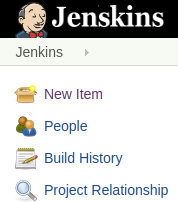


2. Name your project, and select:

```
**Multibranch Pipeline**
```

<br>

### Configure job

You will see tabs to go through:

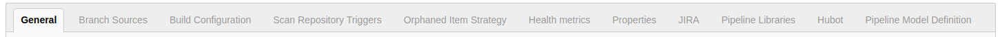


1. **Branch sources**

Hit "Add source"

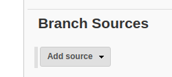


Select "GitHub" from dropdown:

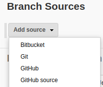

**Fill!!**

 - Credentials
 - Owner
 - Repository

```
NOTE: You might have to wait a bit for Jenkins to retreive Repositories after you set Owner.
```

Fill the rest accustomed by your needs, or go deafult, like:

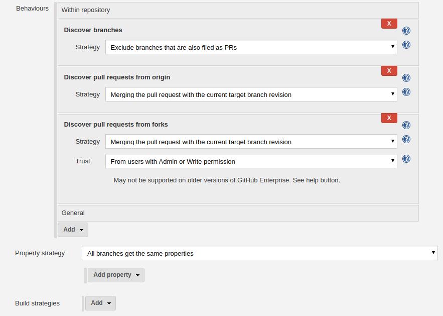

<br>

2. Build configuration

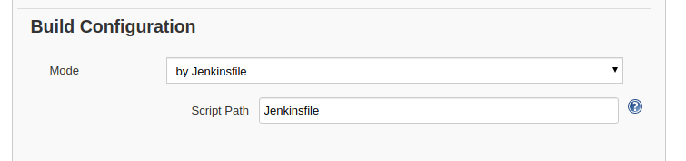

<br>

### Set up credentials in Jenkins for:

  - Docker
  - AWS
  
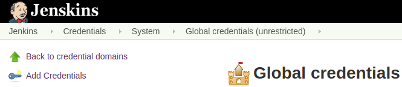
    
<br>

## EB setup - create application and environment

[Login to AWS Console](https://console.aws.amazon.com/console/home) and go to Elastic Beanstalk service.

Create new application.

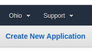

<br>

Create new environment.


<br>

Setup environment:

 - Select Web server environment
 - Select Platform: Docker
 
 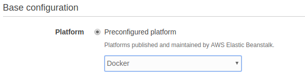
 
 - No need to upload first version of application. 
 
  
 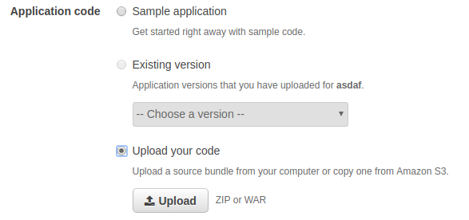
 
 
 Let AWS initialize instance.
 
 ```
 Note: 
 
 1) AWS Elastic Beanstalk will create other dependencies such as: VPC, EC2, S3... 
 In case you need to clean up after the task is done, make sure to delete/terminate those as well 
 or contact support in case of need.
 
 2) To be able to initialize environment AWS will require a default VPC where all the depencihttp://10.27.6.163:9090/blue/organizations/jenkins/create-pipeline/s will be able to connect.
 
```

<br>

## Setup Jenkinsfile

You will need to add Jenkinsfile to the repo for Jenkins pipeline to be able to follow commands.

This pipeline project will go through these stages:

 - Pull github repo content upon change based on webhook.
 - Test the code.
 - Build docker image from the code.
 - Deploy the image to docker hub.
 - Deploy image to AWS Elastic Beanstalk.
 - Remove docker image from Jenkins.
 
 <br>

Your Jenkinsfile should look somehow like this:

**Follow through code and replace pieces between signs <> ... <> with your own code.**

```
pipeline {
  environment {
    registry = "<>docker_user_name/docker_image<>"
    dockerCred = '<>docker_credentials_in_jenkins<>'
    dockerImage = ''
  }
  agent any
  stages {
    stage('Testing') {
      steps {
        sh 'npm init -y'
        sh 'npm install'        
        }
      }
    stage('Building image') {
      steps{
        script {
          dockerImage=docker.build registry + ":$BUILD_NUMBER"
        }
      }
    }
    stage('Deploy Image') {
      steps{
        script {
          docker.withRegistry( '', dockerCred ) {
            dockerImage.push()
            dockerImage.push('latest')
          }
        }
      }
    }
    stage('Deploy to EB') {
      when {
        branch 'master'
      }
      steps{
        withCredentials([[$class: 'AmazonWebServicesCredentialsBinding', accessKeyVariable: 'AWS_ACCESS_KEY_ID', credentialsId: 'bubuska-eb', secretKeyVariable: 'AWS_SECRET_ACCESS_KEY']]) {
          sh 'pip install awsebcli --upgrade --user'
          sh 'echo "1" | eb init <>aws-eb-application-name<> --region <>us-east-2<> && eb use <>aws-eb-environment-name<> && eb deploy <>aws-eb-environment-name<>'
        }
      }
    }
    stage('Cleanup') {
      steps{
        sh 'docker rmi $registry:$BUILD_NUMBER'
        sh 'rm -r node_modules'
        sh 'rm package.json'
      }
    }
  }
}
  
```
<br>

**For better understanding of pipeline syntax, please visit [this site](https://jenkins.io/doc/book/pipeline/syntax/)**

**For better understanding of shell syntax put "/env-vars.html/" after jenkins url.**
**Example: http://195.228.147.126:9090/env-vars.html/**

<br>

```
NOTE:

1. Using AWS EB CLI will complicate your life. If you can, use AWS CLI instead. It will be easier.

2. Due to EB CLI is older then AWS CLI some jenkins plugins might not support it's functionality, 
it might not work for you as you think, and you might not really understand why exactly.

3. To be able to update EB environment via EB CLI I needed tp create a ".elasticbeanstalk" folder in GitHub repo 
and created a **"config.yml"** file in it which containes the follwing two lines:

deploy:
  artifact: Dockerrun.aws.json

This will provide info for EB CLI to tell AWS EB Environment to pull latest docker image from Docker Hub.
AWS will build environment, and will send status code to Jenkins.


4. I use 'echo "1" | eb init aws-eb-application-name --region us-east-2' to select a default environment 
since 'eb init' does not take environment as a positional argument 
and then use 'eb use aws-eb-environment-name' to select the wanted environment.

```

<br>


## Test Jenkins pipeline

Login to Jenkins, go to your project.

#### Build 

In the master branch panel, you should see a menu on the left:

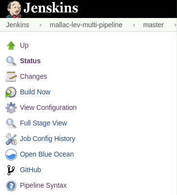

Click on button: **"Build Now"**.

It will build your pipeline, should look like this:

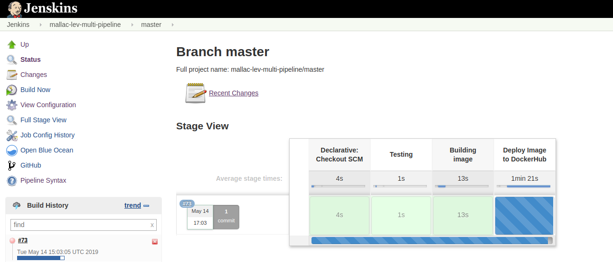

If all goes well, every modification in the GitHub repo will trigger this build event and modify the website or application.

<br>

#### Build failed / Debugging

If something goes wrong, you should see something like this:

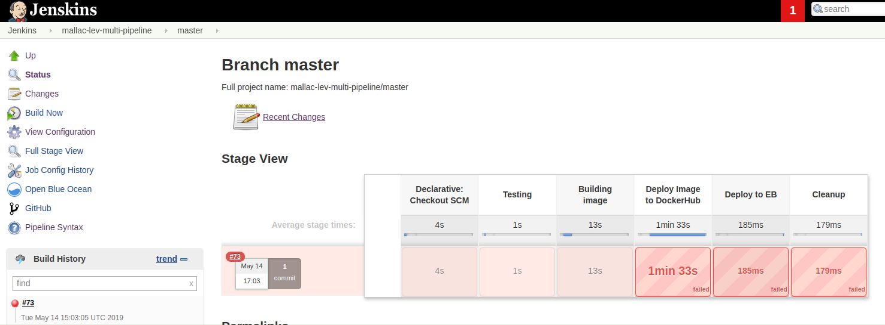

**Build History** is on the left under the menu, click on the dropdown next to the build number.

Select **"Console Output"**.

This will redirect to the console log page, where you can see what is the cause of error.

It should look like something like this:

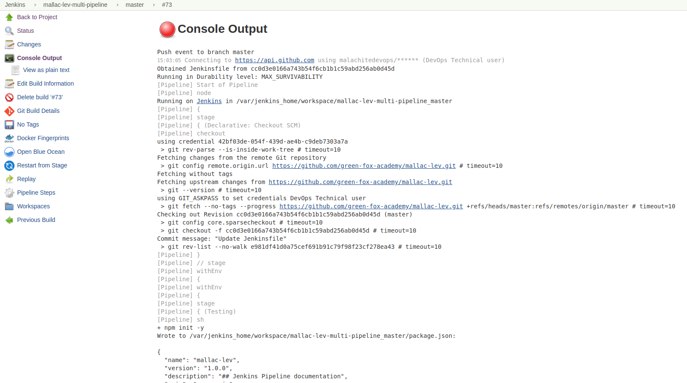


<br>

**SUCCESS**

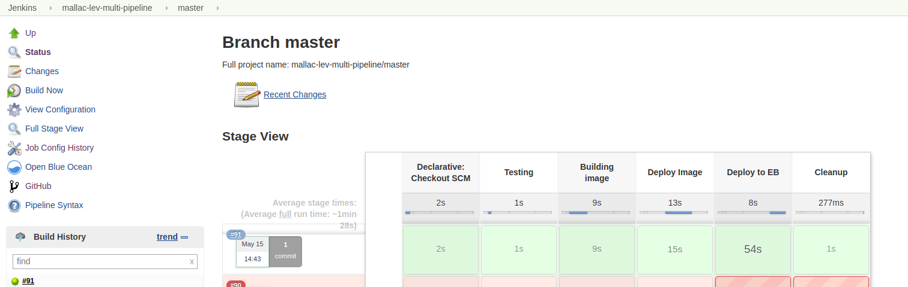
