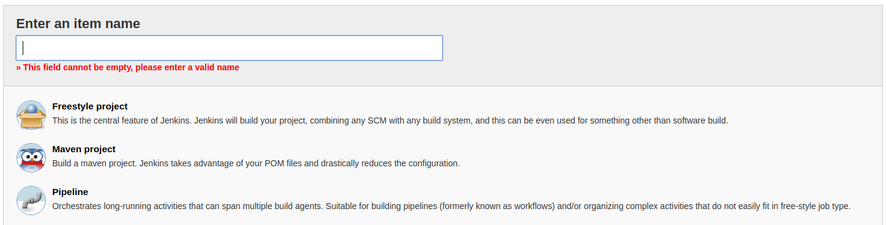
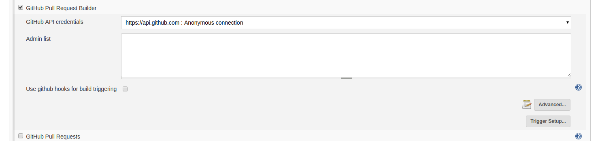
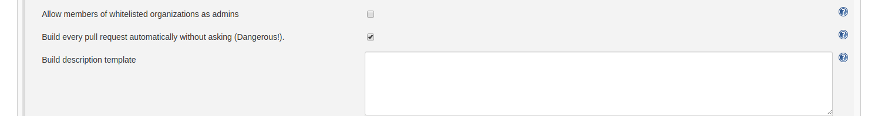
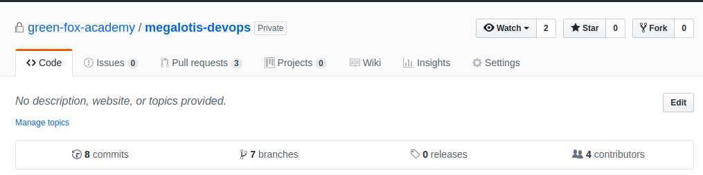
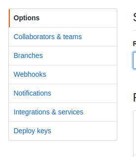
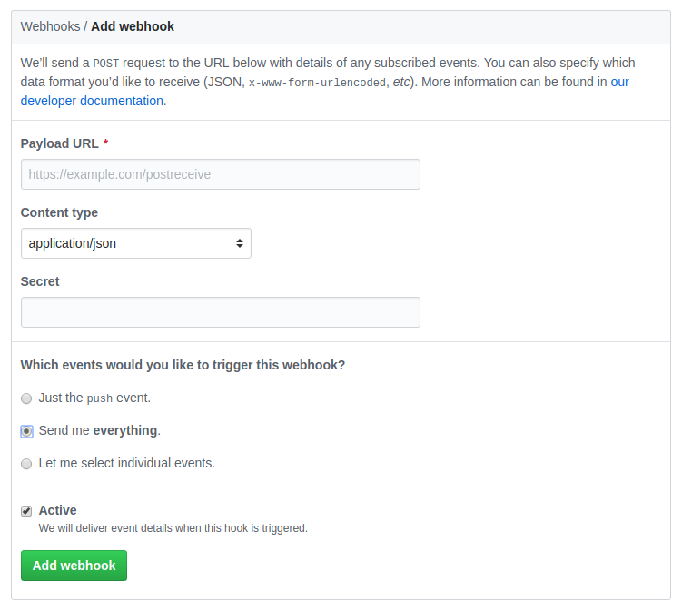

# JENKINS PIPELINE DOCUMENTATION

#### Prerequisites
   - Jenkins account
   - GitHub account and repo
   - Basic knowledge of Webhooks
   
   
## Setting up Jenkins project

### Start new project
Sign in to Jenkins.

On the main page you should see all the projects and the menu on the left.

Go to "New Item" for setting up a new project, the page will redirect.

You should see an input field with title: **Enter an item name** (mandatory), name the project.

Select a **project type** (for testing purpose I reccomend **"Freestyle project"**).



Hit enter or click "Ok" to go on.
<br/><br/>

### Configure new project
On the start of configuration you should see 5 tabs: 

General, Hubot, Source Code Management, Build Triggers, Build Environment, Build, Post-build Actions.


**General**

[OPTIONAL] Set description.

Tick in the check-box: **"GitHub project"**.

Set URL field: **"https://github.com/example-project-url/"**.
<br/><br/>

**Hubot**

Leave all otpions empty.
<br/><br/>

**Source code management**

Select radio-button: **"Git"**.

Repositories: Repository URL: **"https://github.com/example-project-url.git"** (Make sure you have .git on the end of URL.)

Repositories: Credentials: select from dropdown or click on "ADD" button (this profile will have to have permission to make changes on GitHub repo)

Branches to build: Branch Specifier (blank for 'any'): you can leave it empty.
<br/><br/>

**Build triggers**

Tick in the check-box: **"GitHub Pull Request Builder"**



In the greyed oud field in the bottom right corner is button **"Advanced"**. Click on it.

Find the option (below) and tick it in:

```
Build every pull request automatically without asking (Dangerous!).
```

<br/><br/>

**Build environment**

Leave all otpions empty.
<br/><br/>

**Build**

Click on drop-down button: "Add build step".

Select option: **"GitHub PR: set 'pending' status"**.
<br/><br/>

[OPTIONAL]
Click on drop-down button: "Add build step".

Select option: **"Execute shell"**.

Here you can set up any command you wish Jenkins to do (echo Hello Wolrd).

<br/><br/>

**You can now finish configuration by clicking on button "Save"**


<br/><br/>

## Setting up GitHub repo

Log into GitHub and go to project main page.

https://github.com/example-organization/example-project



Go to **"Settings"** tab.




Select menu option **"Webhooks"**.

Click on button **"Add webhook"** (might ask for login again for that)

You should see this page:


<br/><br/>

**Payload URL**

Set Jenkins URL where you want to send the info to from github.

Example-URLs:

http://195.228.147.126:9090/github-webhook/  (all events)

http://195.228.147.126:9090/ghprbhook/  (pull_request and push)
<br/><br/>

**Content type**

Select **application/json**.
<br/><br/>

**Secret**

[OPTIONAL] can be empty
<br/><br/>

**Which events would you like to trigger this webhook?**

Select the one to your requirements (reccomended: "Send me everything")
<br/><br/>

**Active**

Tick in thee checkbox.

<br/><br/>

**You can now finish configuration by clicking on button "Add webhook"**

**NOTE: if the webhook is successfully set up, a geen pipe (tick) should appear on the left of the link**
